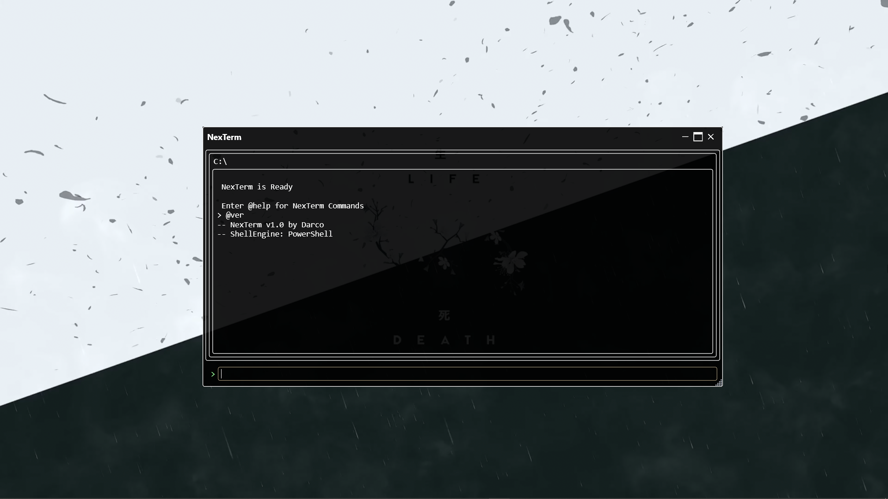

# NexTerm 🖥️

**NexTerm** is a customizable terminal built with WPF and C#, NexTerm uses PowerShell with custom NexTerm-exclusive commands — all wrapped in a modern, minimal interface.

---

## ⚙️ Project Status

 **NexTerm is currently in active development**
 It may have bugs, but it's improving with every update
 The long-term goal is to make it a **fully customizable**, developer-friendly terminal alternative

---

##  Features

-  **Run native PowerShell commands**
-  **NexTerm-exclusive commands:**
  - `@help` — List all available commands
  - `@clear` — Clear terminal output
  - `@ver` — Show version info
  - `@history` — View command history
-  **Real-time directory tracking**
-  Designed to be fast, simple, and extensible

---

## Screenshots

##  Coming Soon

-  **Tabbed terminal support**
-  **Addon/plugin system**
-  **Theme and UI**
