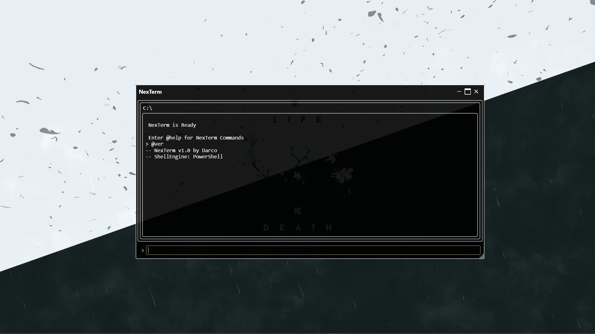

# NexTerm 🖥️

**NexTerm** is a customizable terminal built with WPF and C#, NexTerm uses PowerShell with custom NexTerm-exclusive commands — all wrapped in a modern, minimal interface.

---

## ⚙️ Project Status
**NexTerm is an archived project.**
It was built as an experimental C# project to learn more about Windows APIs and terminal development.
Development was stopped after it served its purpose as a learning project.

---
 
## 📷 Video

https://github.com/user-attachments/assets/f40f8781-2921-4336-ae87-607f4a7d12d0

 Music: [**Poppy by Chillpeach**](https://www.youtube.com/watch?v=BLAFzMspngw&list=PLQwRmTwWx0uaoRXVcKbUDW0wm8G_WJzDI&index=4)

## ✨ Features

-  **Run native PowerShell commands**
-  **NexTerm-exclusive commands:**
  - `@help` — List all available commands
  - `@clear` — Clear terminal output
  - `@ver` — Show version info
  - `@history` — View command history
-  **Real-time directory tracking**
-  Designed to be fast, simple, and extensible

---

## Screenshots

